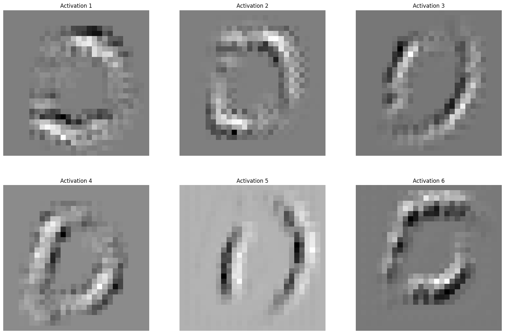
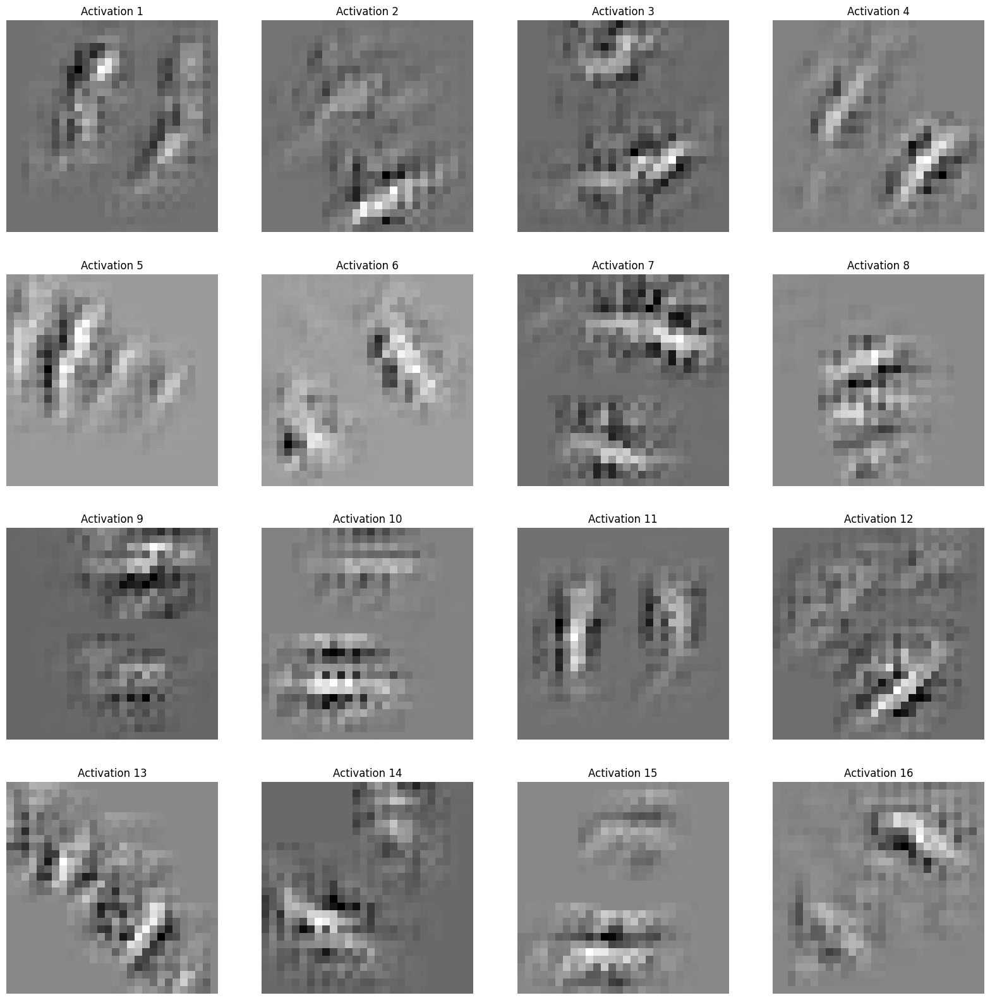
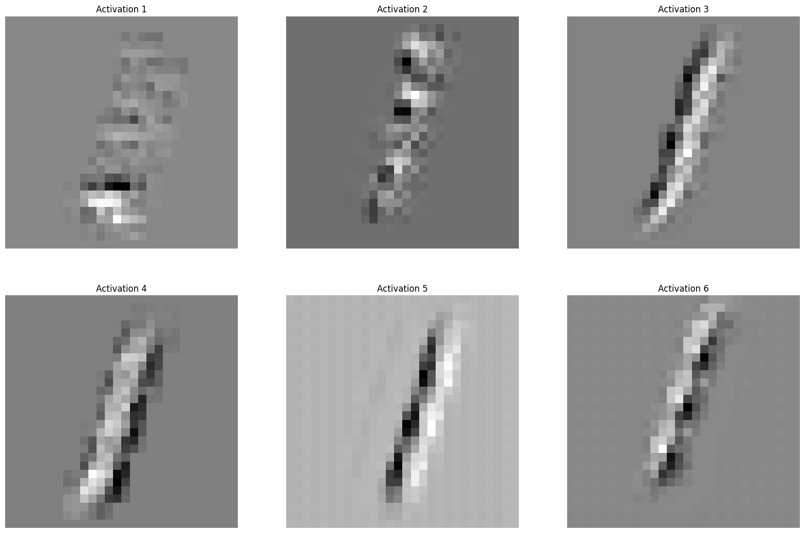
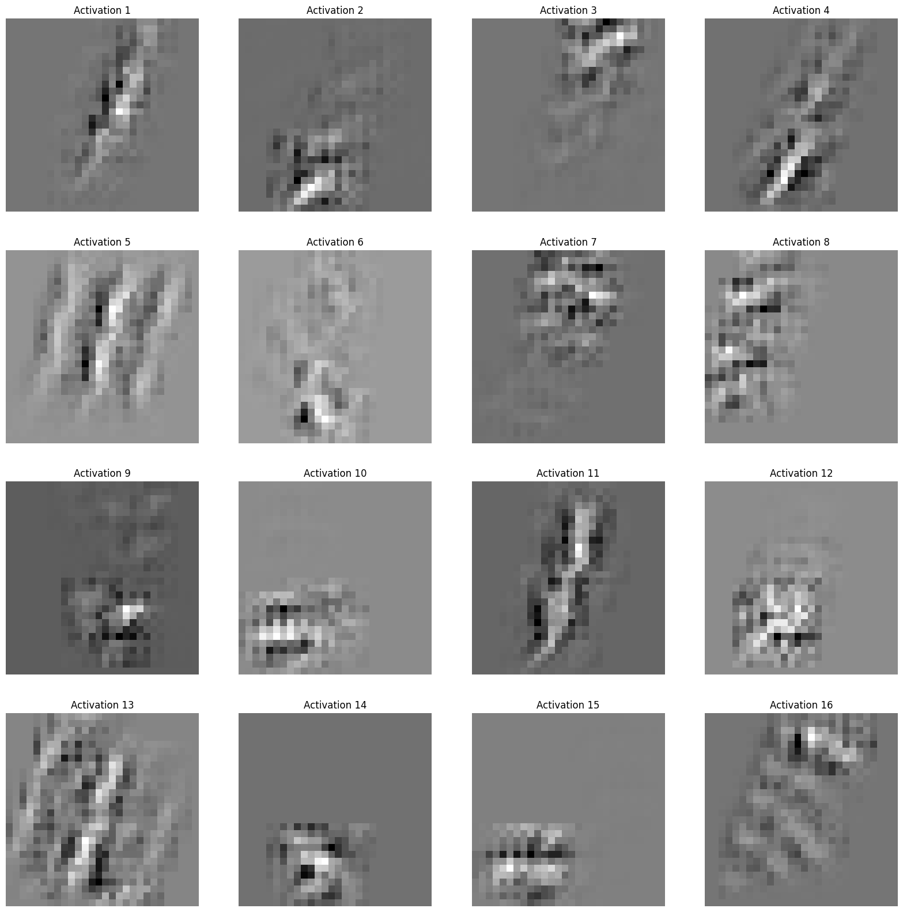
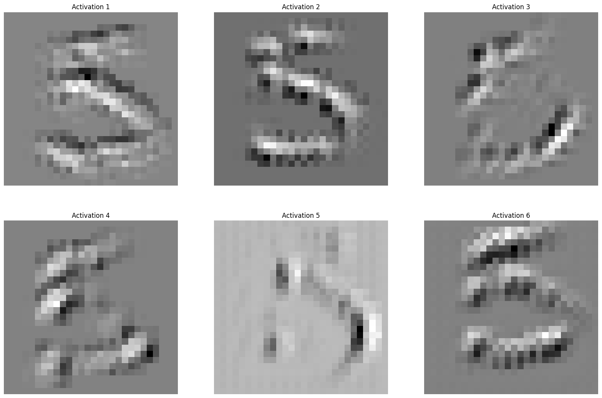
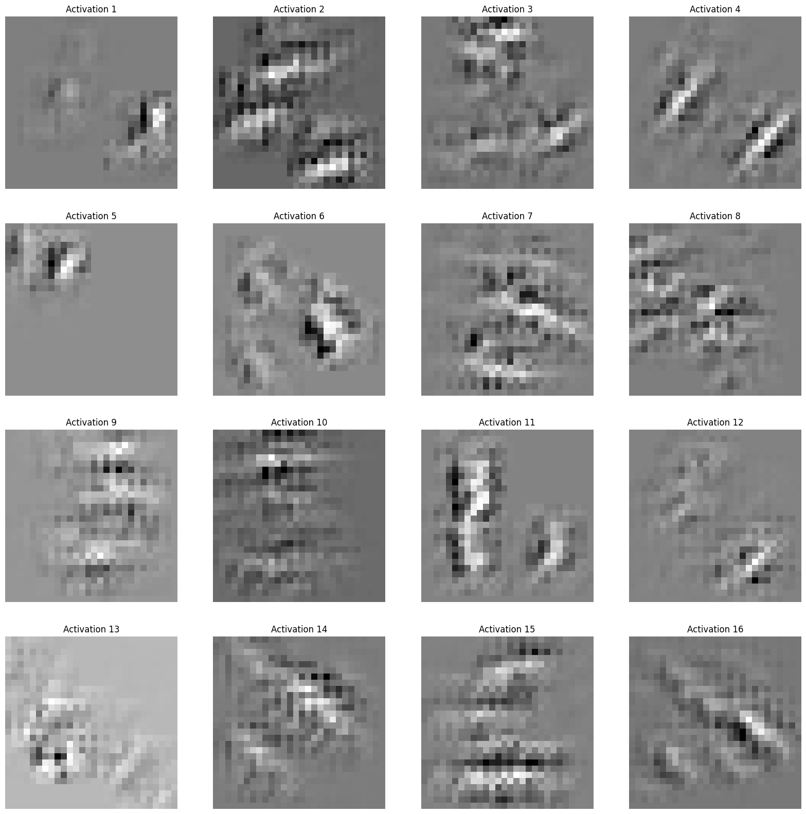
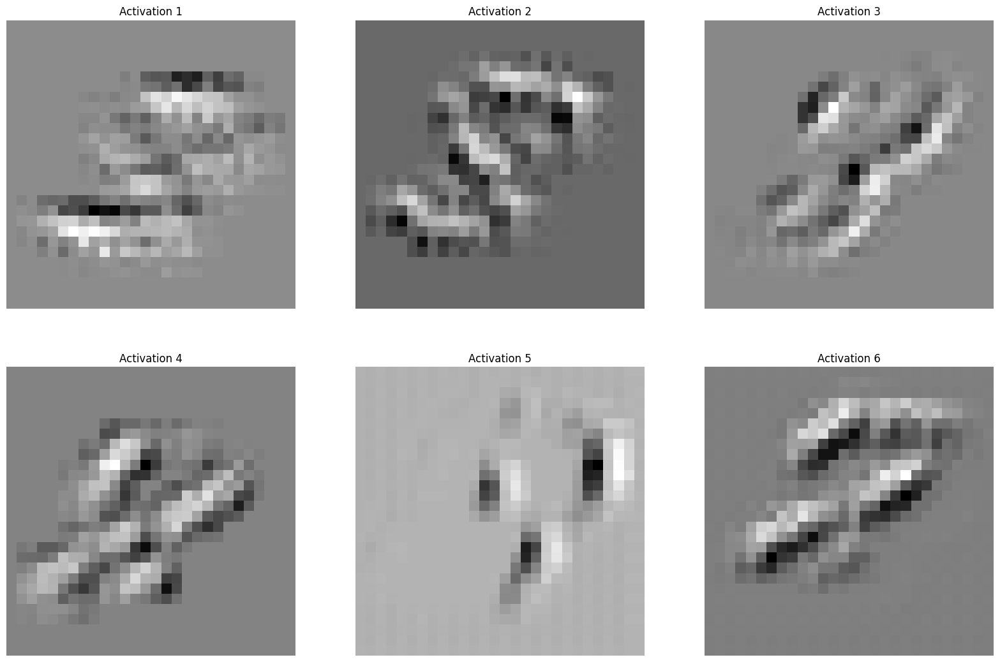
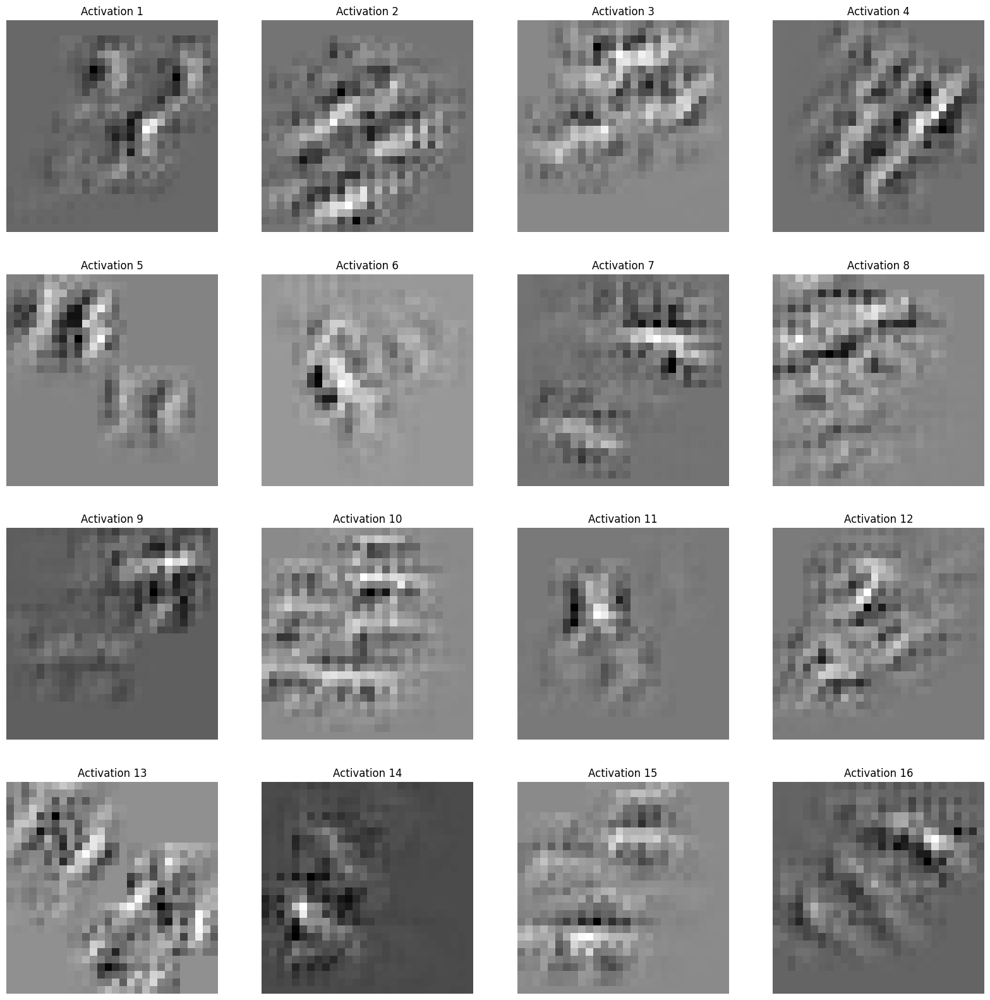

# Visualizing-CNN
Visualization technique that gives insight into the function of intermediate feature layers and the operation of a Convolutional Neural Network.
(Implementation of [Visualizing and Understanding Convolutional Networks](https://arxiv.org/abs/1311.2901) for LeNet-5 and MNSIT dataset.)

# Results
Activation images for digit: 0 

Layer 1:

Layer 2:

<!-- 

 -->

Activation images for digit: 8

Layer 1:

Layer 2:

# Summary of the paper
The paper "Visualizing and Understanding Convolutional Networks" is a seminal work in the field of interpretability of deep neural networks, specifically convolutional neural networks (CNNs). The authors propose a suite of techniques for visualizing the representations learned by CNNs and understanding their internal workings.

The paper starts by introducing the concept of "neuron visualization," which generates images that maximize the activation of individual neurons in a CNN. By iteratively adjusting an input image to maximize the activation of a particular neuron, the authors demonstrate how to create images that highlight the features that a neuron has learned to detect. The technique is applied to various CNNs trained on image classification tasks, and the resulting visualizations provide insights into the types of features that different neurons are sensitive to.

Next, the authors introduce a technique for visualizing the patterns that activate entire feature maps in a CNN. By optimizing an input image to maximize the activation of a feature map, the authors are able to generate images that reveal the spatial patterns that a feature map has learned to respond to. This technique is extended to visualize the evolution of feature maps across different layers of a CNN, providing a hierarchical view of the representations learned by the network.

The paper also explores the effect of pooling operations on the feature maps of a CNN. By visualizing the changes in feature map activations before and after pooling, the authors demonstrate how pooling can be used to increase the invariance of a CNN to small translations and other spatial transformations.

Finally, the paper shows how the proposed visualization techniques can be used to diagnose common problems in CNNs, such as overfitting and co-adaptation of features. By comparing the visualizations of CNNs with different levels of regularization and different architectures, the authors provide insights into the factors that influence the generalization performance of CNNs.

Overall, the paper presents a comprehensive set of techniques for visualizing and understanding the representations learned by CNNs. These techniques have had a significant impact on the field of deep learning, enabling researchers and practitioners to gain insights into the internal workings of CNNs and diagnose common problems.